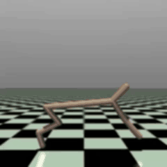
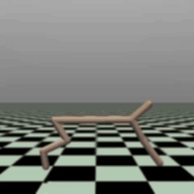

# mujoco_erastic_rl

<p align="center">
  
  
</p>

This is a reinforcement learning environment that uses the simplest PPO and Mujoco Half-Cheater as elastic bodies in a slippery setting.  
(最も単純なPPOとMujoco Half-Cheaterを滑りやすい設定の弾性体として使用する強化学習環境です。)   

In mujico's typical rigid body physics environment, reinforcement learning often generates unrealistic movements that exploit the repulsive forces at the contact surfaces of rigid bodies.
If this is the optimal movement that can be easily acquired in that environment, we experimented with what would happen if the environment were simply made slippery and bouncy.   
As expected, this alone allowed us to reproduce more natural cheetah movements.   

(mujico の通常の剛体物理環境では、強化学習によって剛体の接触面の反発力を利用した非現実的な動きが生成されることがよくあります。
もしこれがその環境で容易に獲得できる最適な動きだとしたら、環境を単純に滑りやすく弾力性のあるものにしたらどうなるかを実験しました。
予想通り、これだけでより自然なチーターの動きを再現することができました。)   

## Erastic Half Cheetah config
assets/half_cheetah_soft.xml

## env 環境

If you are installing it yourself in a proper environment from scratch, please refer to the following.  
You may encounter some dependency issues.  

(自分で最初から正式な環境でインストールする場合は以下を参考にしてください。
いくつか依存関係の問題が出るかもしれません。)  

 - Gymnasium  
 https://github.com/Farama-Foundation/Gymnasium

 - baselines3  
https://github.com/DLR-RM/stable-baselines3

## Installation

```bash
pip install -r requirement.txt
cd .\Gymnasium-1.1.1\
pip install -e ".[mujoco]"
pip install -e ".[other]"
cd ..
cd stable-baselines3-2.6.0
pip install -e ".[extra]"
cd ..
```

## How to Run
```bash
cd
```

```python
import torch
from ncps.torch import CfC

rnn = CfC(20,50) # (input, hidden units)
x = torch.randn(2, 3, 20) # (batch, time, features)
h0 = torch.zeros(2,50) # (batch, units)
output, hn = rnn(x,h0)
```

## Usage: Models and Wirings

The package provides two models, the liquid time-constant (LTC) and the closed-form continuous-time (CfC) models.
Both models are available as ```tf.keras.layers.Layer``` or ```torch.nn.Module``` RNN layers.


```python
from ncps.torch import CfC, LTC
from ncps.wirings import AutoNCP

wiring = AutoNCP(28, 4) # 28 neurons, 4 outputs
input_size = 20
rnn = CfC(input_size, wiring)
rnn = LTC(input_size, wiring)
```

## Memo 
   https://github.com/google-deepmind/mujoco/releases
   mujoco-3.3.2-windows-x86_64.zip

